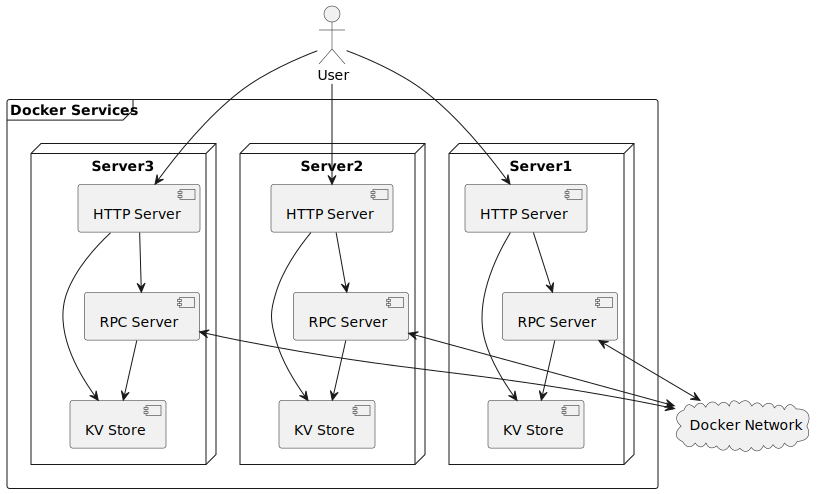
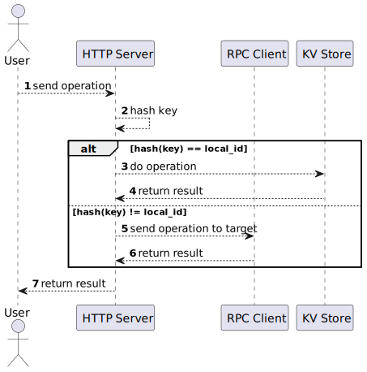
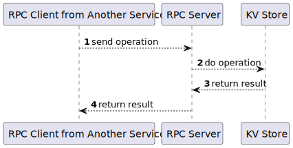

# Very Simple KV

基于python实现简易分布式KV存储系统，作分布式系统作业用。

**NOTICE** 这只是一个作业DEMO，只有简单的数据分发功能，不支持节点增减、故障检测、数据副本、持久化等复杂功能！

## 如何开始

1. 配置docker和docker-compose环境，你可以在windows系统中安装docker-desktop或在linux系统通过包管理器进行安装

2. 第一次运行：构建镜像并运行容器
```shell
./scripts/build_and_run.sh
```
此脚本会执行以下步骤：
- 1. 构建名为simplekv的镜像，包含python程序
- 2. 创建名为simplekv_rdp的桥接网络
- 3. 通过docker-compose启动server1/server2/server3共3个容器
- 4. 挂载容器的日志文件到`logs/`目录中
- 5. 挂载外部端口9527/9528/9529到内部端口80
- 6. 将容器连接到网络

3. 通过HTTP请求访问任一容器进行调用，用法详见[接口描述](#2.1)

4. 停止运行
```shell
./scripts/stop.sh
```

5. 再次启动（未修改代码的情况下，如果修改代码，请执行步骤2）
```shell
./scripts/run.sh
```

## <h2 id="2.1">接口描述</h2>

启动容器后，你可以访问[http://127.0.0.1:9527/docs](http://127.0.0.1:9527/docs)或任意端口查看并使用在线文档。


| 方法     | URL    | 类型   | 参数     | 说明                                            |
| :------- | :----- | :----- | :------- | :---------------------------------------------- |
| 新增键值 | /      | POST   | json:str | 提交格式为{key:value}的JSON字符串               |
| 获取值   | /{key} | GET    | key:str  | 在URL中指定key，返回{key:value}或404(key不存在) |
| 删除值   | /{key} | DELETE | key:str  | 在URL中制定key，返回1(删除成功)或0(删除失败)    |

## 实现方法

### 物理结构

本系统是一个分布式KV存储，各个节点以容器形式独立运行，容器之间docker网络相互通信。

每个容器中包括一个HTTP服务器、一个RPC服务器和一个本地KV存储。HTTP用于直接向外暴露，接收用户请求；RPC服务器不向外暴露，用于接收其他容器的请求。KV存储通过HTTP服务器和RPC服务器进行交互。



### 执行流程

当一个容器的HTTP服务器收到用户请求时，会进行如下操作：
1. 通过hash分配请求所属容器
2. 如果属于本地，与本地的KV存储交互
3. 如果不属于本地，向对应的RPC Server发送请求
4. 返回KV存储或RPC Server的结果到用户



当一个容器的RPC服务器收到内部请求时，会进行如下操作：
1. 与本地KV存储交互
2. 将KV存储的结果返回给RPC客户端



## 说明

本项目基于fastapi/rpyc快速搭建，uml图采用plantuml语言绘制，感谢这些项目作者的杰出贡献！